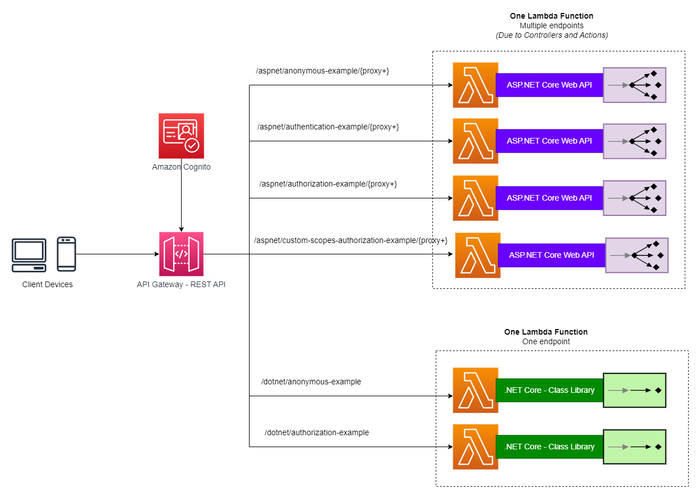
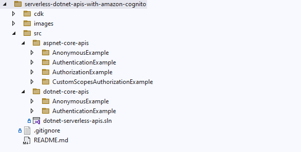

[](https://github.com/ankushjain358/serverless-dotnet-apis-with-amazon-cognito/actions/workflows/dotnet.yml)

# Serverless .NET APIs using AWS Lambda, Amazon API Gateway and Amazon Cognito

This repository provides you code samples along with the guidance how you can build serverless .NET APIs on AWS and secure them with Amazon Cognito.

This repository contains sample .NET applications that can be deployed as **Lambda functions** and exposed as APIs using the **[Amazon API Gateway REST API](https://docs.aws.amazon.com/apigateway/latest/developerguide/apigateway-rest-api.html)**.

The following AWS services are used while building serverless .NET APIs on AWS:

- Amazon API Gateway
- AWS Lambda Function
- Amazon Cognito
- AWS CDK *(used for the deployment)*

## Table of Contents
- [Benefits of building serverless .NET APIs](#benefits-of-building-serverless-net-apis)
- [Architecture](#architecture)
- [Directory Structure](#directory-structure)
- [How to deploy](#how-to-deploy)
- [API Gateway routes](#api-gateway-routes)
- [How to Test](#how-to-test)

## Benefits of building serverless .NET APIs
Below are some of the primary benefits of building serverless .NET APIs on AWS:

- Cost-effective APIs
- Completely serverless, no maintainence overhead
- Highly available
- Highly scalable
- Secured with Cognito

## Architecture


## Directory Structure


## How to deploy
### Prerequisites

Here's what you need to install to use the AWS CDK.

- [Node.js](https://nodejs.org/en/download/) 14.15.0 or later
- [AWS CLI](https://docs.aws.amazon.com/cli/latest/userguide/getting-started-install.html)
- [AWS CDK Toolkit](https://docs.aws.amazon.com/cdk/v2/guide/getting_started.html#getting_started_install)
- .NET 6.0 or later, [available here](https://dotnet.microsoft.com/en-us/download)

After having all the above prerequisites, you must establish how the AWS CDK authenticates with AWS. To learn how to do this, refer [authentication with AWS](https://docs.aws.amazon.com/cdk/v2/guide/getting_started.html#getting_started_auth).

### Deployment steps
1. Run `git clone <repo-url>` to clone the repository.
2. Run `cd ./cdk/src` to navigate to the CDK application project.
3. Run `dotnet restore` to install all the necessary dependencies.
4. If this is your first time deploying the CDK stack in the AWS account, run `cdk bootstrap`.
5. Run `dotnet build` to compile the application and ensure there are no build errors.
6. Run `cd..` to return one level back where `cdk.json` file is present.
7. Run `cdk deploy` to deploy your CDK stack to AWS.
8. Confirm the changes when prompted. Type "y" to proceed with the deployment.
9. Once the deployment is complete, monitor the AWS CloudFormation events to ensure that the stack creation/update was successful.

## API Gateway routes
After the deployment, you can access the following endpoints to check the behavior of the serverless .NET APIs running on the AWS cloud.

```
https://<random-text>.execute-api.<region>.amazonaws.com/<stage-name>/
|-- aspnet/
|   |-- anonymouse-example/{proxy+}
|   |-- authentication-example/{proxy+}
|   |-- authorization-example/{proxy+}
|   `-- custom-scopes-authorization-example/{proxy+}
`-- dotnet/
    |-- anonymouse-example
    `-- authorization-example
```

## How to test
1. Use ThunderClient extension in VS Code to test the APIs.
2. Import the `collections` and `environment variables` in ThunderClient from `thunder-client` folder.
3. Update the environment variable values with their actual values.
4. Save everything.
5. You're good to go!
